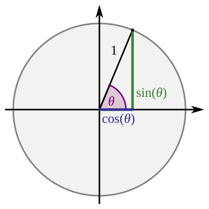
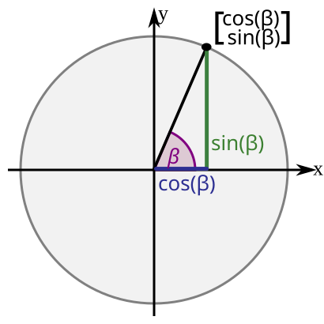
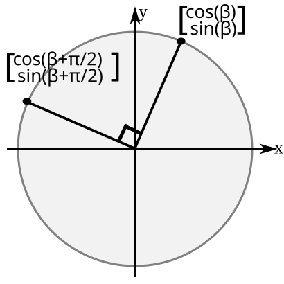
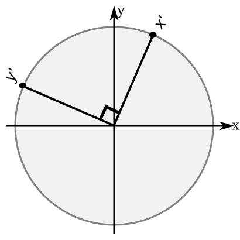
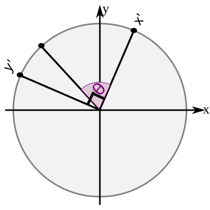
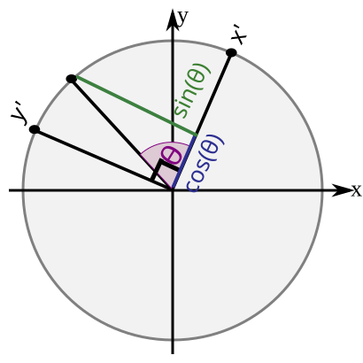
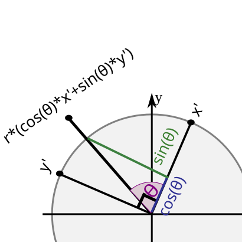

..
   Copyright (c) 2026 William Emerison Six

   Permission is granted to copy, distribute and/or modify this document
   under the terms of the GNU Free Documentation License, Version 1.3
   or any later version published by the Free Software Foundation;
   with no Invariant Sections, no Front-Cover Texts, and no Back-Cover Texts.

   A copy of the license is available at
   https://www.gnu.org/licenses/fdl-1.3.html.

Proof: Rotate
=============

This is the precalculus-level derivation of what it means to **rotate a point about
the origin (0, 0)** by an angle :math:`\theta`. It is the foundation the rest of the
book is built on — the bridge from what you already know in high-school math. We reduce
to coordinates here on purpose; later, once we have the geometric product
(:doc:`geometric-product`), we throw the coordinates away.

(Adapted from William Emerison Six's *Model View Projection*, "Rotations".)

The goal
--------

In high school you learned about sine, cosine, and tangent, with angles described on
the unit circle, a rotation starting from the positive :math:`x` axis.

   Sine and cosine on the unit circle (Stephan Kulla, CC0).

We want to expand on that, so we can rotate **any** point :math:`\vec{a}`, wherever it
is, about the origin by some angle :math:`\theta`. Call the rotated point
:math:`\vec{r}(\vec{a}; \theta)`.

.. figure:: _static/cc0/williamesix/rotate-goal.svg
   :align: center
   :alt: the goal — rotate a-vector by theta

From high school geometry, a Cartesian point :math:`(x, y)` can be described by its
length :math:`r` and the cosine and sine of its angle.

The change-of-frame trick
-------------------------

Sine and cosine are preserved when a right triangle is scaled up or down (similar
triangles), so we work on the unit circle but **remember** the length of
:math:`\vec{a}`, which we call :math:`r`. Call the angle of :math:`\vec{a}` itself
:math:`\beta` — and remember, the angle we actually want to rotate *by* is a different
one, :math:`\theta`.

Before we can rotate by :math:`\theta`, we first need to rotate by 90°
(:math:`\pi/2`). Rotating :math:`(\cos\beta, \sin\beta)` by :math:`\pi/2` gives
:math:`(\cos(\beta + \pi/2),\ \sin(\beta + \pi/2))`.

Now give those two directions new names, :math:`\vec{x'}` and :math:`\vec{y'}`, so we
can ignore their details for a moment (just as we set :math:`r` aside above).

Now **forget about** :math:`\beta`, and remember our goal is to rotate by
:math:`\theta`. Look at the picture below while tilting your head slightly to the
left: :math:`\vec{x'}` and :math:`\vec{y'}` look just like the ordinary Cartesian
plane and unit circle — this is exactly the high-school picture we already know.

So in this new frame we can rotate :math:`\vec{x'}` by :math:`\theta` and read off a
right triangle on the unit circle.

The rotated **direction** is therefore :math:`\cos(\theta)\,\vec{x'} +
\sin(\theta)\,\vec{y'}`.

and finally we scale it back to length :math:`r`.

Now the algebra
---------------

Stop thinking about geometry — from here it is only algebra. Do **not** try to draw
these formulas.

Substitute the values of :math:`\vec{x'}` and :math:`\vec{y'}` back in. The angle of
:math:`\vec{a}` is :math:`\beta`, so :math:`\cos\beta = \vec{a}_x / r` and
:math:`\sin\beta = \vec{a}_y / r`. And by the angle-addition identities,
:math:`\cos(\beta + \pi/2) = -\sin\beta` and :math:`\sin(\beta + \pi/2) = \cos\beta`
— so we never need :math:`\beta` itself, only the sine and cosine we already have.

.. math::

   \begin{aligned}
   \vec{r}(\vec{a}; \theta)
     &= r\,\big(\cos\theta\,\vec{x'} + \sin\theta\,\vec{y'}\big) \\
     &= r\,\Big(\cos\theta \begin{bmatrix} \cos\beta \\ \sin\beta \end{bmatrix}
              + \sin\theta \begin{bmatrix} \cos(\beta + \pi/2) \\ \sin(\beta + \pi/2) \end{bmatrix}\Big) \\
     &= r\,\Big(\cos\theta \begin{bmatrix} \vec{a}_x / r \\ \vec{a}_y / r \end{bmatrix}
              + \sin\theta \begin{bmatrix} -\vec{a}_y / r \\ \vec{a}_x / r \end{bmatrix}\Big) \\
     &= \cos\theta \begin{bmatrix} \vec{a}_x \\ \vec{a}_y \end{bmatrix}
              + \sin\theta \begin{bmatrix} -\vec{a}_y \\ \vec{a}_x \end{bmatrix} \\
     &= \cos\theta\,\vec{a} + \sin\theta \begin{bmatrix} -\vec{a}_y \\ \vec{a}_x \end{bmatrix}
   \end{aligned}

The :math:`r`'s cancel, and we are left with the whole point of this chapter:

.. math::

   \vec{r}(\vec{a}; \theta) = \cos\theta\,\vec{a} + \sin\theta\,\vec{r}(\vec{a}; \pi/2),
   \qquad \vec{r}(\vec{a}; \pi/2) = \begin{bmatrix} -\vec{a}_y \\ \vec{a}_x \end{bmatrix}.

**A rotation is a blend of the point and its 90°-rotated self.** That is worth staring
at. The next chapter, :doc:`geometric-product`, notices that the 90° rotation
:math:`(-\vec{a}_y, \vec{a}_x)` is itself a *product* — and that observation is where
the geometric product comes from.
