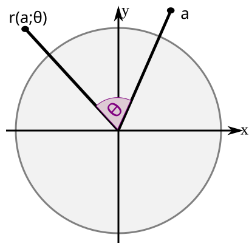

..
   Copyright (c) 2026 William Emerison Six

   Permission is granted to copy, distribute and/or modify this document
   under the terms of the GNU Free Documentation License, Version 1.3
   or any later version published by the Free Software Foundation;
   with no Invariant Sections, no Front-Cover Texts, and no Back-Cover Texts.

   A copy of the license is available at
   https://www.gnu.org/licenses/fdl-1.3.html.

Rotate
======

Rotation is the operation this whole book is built on. We will define it the way
*Model View Projection* does: **not by an angle, but from the direction of one vector
to another** — rotate so that the direction of :math:`\vec{v_1}` is carried onto the
direction of :math:`\vec{v_2}`. The **magnitudes don't matter**; only the directions
set the rotation.

But before that coordinate-free version, we should see where rotation *comes from* —
the ordinary high-school trigonometry everything here connects to. That derivation is
the foundation, so read it first:

Then, once we have the **geometric product** (:doc:`geometric-product`), we define
rotation again — coordinate-free — and check that the two agree.

.. toctree::
   :maxdepth: 1

   proof-rotate
   notebooks/rotate
